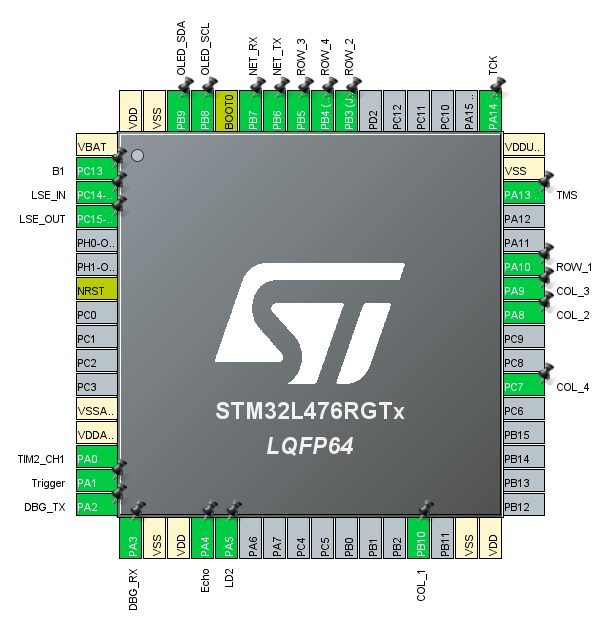

# SecureMatrix Access System
The SecureMatrix Access System is an advanced solution for access control using a digital locking system. This system not only allows input via a numeric keypad but also provides remote control via WiFi connection. Incorporating the HC-SR04 ultrasonic sensor, the system is able to detect presence and activate alerts or access mechanisms, making it a safe and versatile option for residential or commercial installations. Please go to the [C4Model](Doc/C4Model.md) diagrams for more details on the functionality of the system.

## Description
This project integrates multiple technologies to create a versatile access control system. Using a matrix keyboard for password entry, an ultrasonic sensor for presence detection, and a buzzer for alerts in Morse code, SecureMatrix Access System offers a comprehensive security solution for residential and commercial environments. In addition, its WiFi functionality allows remote management and system configuration.

## Main features
* User Authentication: Access control using a matrix keyboard with password system.
* Presence Detection: Use the HC-SR04 ultrasonic sensor to trigger alerts or actions.
* Morse Code Alerts: Issuing security alerts through a buzzer.
* UART communication: For debugging and logging system events.
* Wifi Control: Remote management and configuration via a WiFi connection.
* Locking system: Efficient implementation in STM32 microcontroller.

## Hardware prerequisites
* Microcontroller STM32L4, which manages the central processes of the system.
* ESP8266 module for WiFi connectivity and Internet access.
* Hexadecimal keyboard for local command input.
* OLED display providing user interface and system feedback.
* HC-SR04 ultrasonic sensor for presence detection.
* Buzzer for audible alerts in Morse code.
* LED to simulate the status of the lock actuator.
*  See more details in the [C4Model](Doc/C4Model.md) The following is the pinout of the STM32: 

## Firmware prerequisites
* The ESP8266 runs the esp-link [v2.2.3](https://github.com/jeelabs/esp-link/releases/tag/v2.2.3) firmware. Please follow the [serial flashing guide](https://github.com/jeelabs/esp-link/blob/master/FLASHING.md#initial-serial-flashing).
* The STM32 runs the firmware compiled from this repository using STM32CubeIDE.

  
## Building and Flashing
* Open the project in STM32CubeIDE.
* Compile using the current project settings.
* Use an ST-LINK to flash the firmware into the STM32.

## Functionality
* Local access by entering a valid code on the keyboard.
* Remote access via internet commands, with the ESP8266 module facilitating communication.
* Presence detection activates the system and can trigger alerts.
* The system issues alerts in Morse code through a buzzer when it detects presence.
* Periodic metrics are sent over the Internet every 24 hours using the built-in RTC alarm.

## Contact info
* Johan_Bejarano - jobejaranom@unal.edu.co
